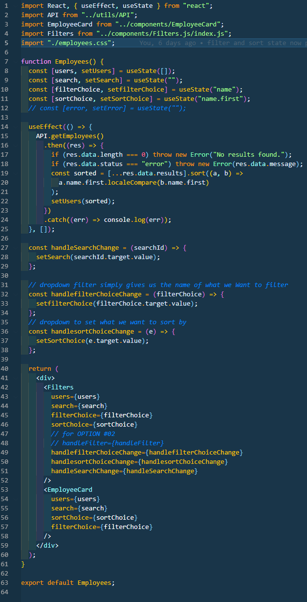
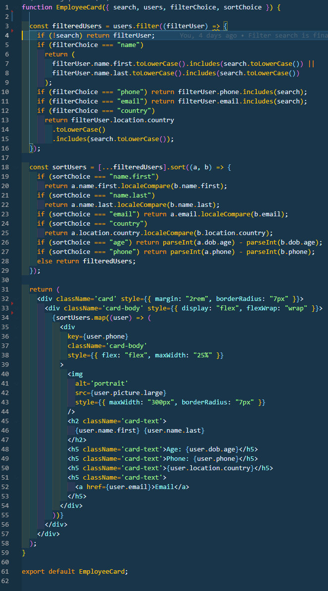
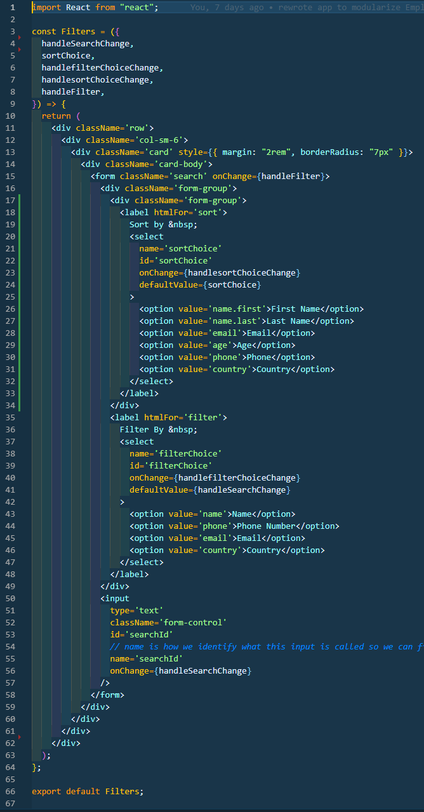

<h1 align="center">Employee Tracker</h1>

<p align="center">
    
    
    
    
    <a href="https://github.com/themancalledzac">
        
    </a>
    <a href="https://twitter.com/themancalledzac">
        
    </a>
</p>
  
<p align="center">
    
    
    
    
</p>

## Table of Contents

- [Links](#links)
- [Description](#description)
- [User Story](#user-story)
- [Acceptance Criteria](#acceptance-criteria)
- [Installation](#installation)
- [Usage](#usage)
- [Code](#code)
- [Questions](#questions)

## Links

- [Heroku Live Link](https://react-employee-directory-edens.herokuapp.com/)

- [Github Repo](https://github.com/themancalledzac/react-employee-directory)

## Description

For this class assignment, we were tasked with creating an employee directory with React. Being the first react project, some successes were successfully breaking the project into components, passing state, but also getting the sorting and filtering to work flawlessly based off the desired outcome.

## User Story

```
- As a user, I want to be able to view my entire employee directory at once so that I have quick access to their information.
```

## Acceptance Criteria

```
Given a table of random users generated from the [Random User API](https://randomuser.me/), when the user loads the page, a table of employees should render.

The user should be able to:

- Sort the table by at least one category

- Filter the users by at least one property.
```

## Installation

```
'npm init -y' to install our package.json file.

'npm i' to install all necessary packages to run our application.

```

## Code

```
app.js file
```


```
employees.js file
```



```
employeeCard.js file
```



```
filter.js file
```



## Questions

Feel free to contact me with any questions.

[Email](mailto:themancalledzac@gmail.com)

[Github](https://github.com/themancalledzac)

[Twitter](https://twitter.com/themancalledzac)

[Instagram](https://www.instagram.com/themancalledzac/)
